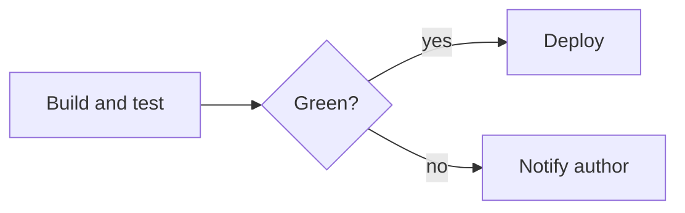

# Release pipeline

The pipeline runs on every push. The pipeline must stay under ten minutes.

## Stages

| Stage | Owner | Budget |
| ----- | ----- | ------ |
| Build | infra | 3 min  |
| Test  | dev   | 6 min  |

```sh
make build && make test
```



Deploys are blocked when the pipeline is red.

## Release

> Tag the build with `git tag` once **both** stages
> pass, then run `make release`.

Deploys are blocked when the tag is missing.
